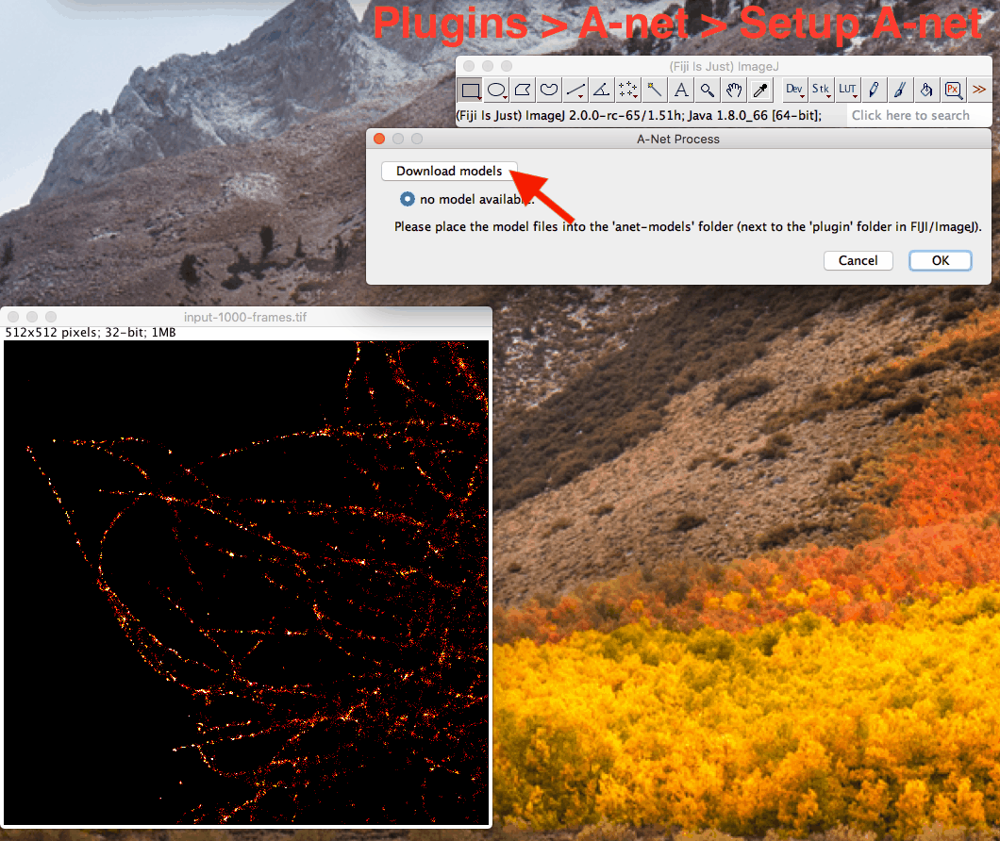
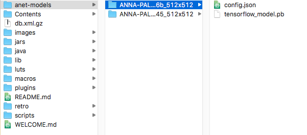

# Anet plugin for ImageJ

Process images with pre-trained models for ANNA-PALM, using Tensorflow-java backend.

For more details, please checkout the [ANNA-PALM project website](https://annapalm.pasteur.fr) and also [this repository](https://github.com/imodpasteur/ANNA-PALM).

## Installation

* Download the Anet-ImageJ plugin: [Anet-ImageJ v0.2.2](https://github.com/imodpasteur/Anet-ImageJ/releases/tag/0.2.2).
* Copy the .jar file into your ImageJ plugin folder (note: Fiji might not work anymore), or directly drag the .jar file into ImageJ (then restart ImageJ).
* You will find an `A-net` entry in `Plugins` of ImageJ menu.

## Usage

* For the first time, click `Setup A-net` in the ImageJ `Plugins` menu ("Plugins => A-Net => Setup"), in the dialog, click the download button and wait until you see a list of models.
* select a model and click `ok`.
* Open your image, notice that your image size must match the model input, different model can have different input image size. By default, built-in models has the input size of 512x512. If your input image is bigger or smaller than that, you will need to crop or pad with zeros manually in ImageJ.
* Click `Run A-net`, select input images, and then click `ok`
* Wait for a while, you should be able to see the result in a pop image window.

Sample images can be downloaded from here: [STORM image 1000 frames (used as figure 4 in the paper), cropped to 512x512](./img/figure4c-PALM-1000frames-512crop.tif), [full size version (2560x2560)](./img/figure4c-PALM-1000frames.tif), more sample images can be exported from [https://annapalm.pasteur.fr](https://annapalm.pasteur.fr/#/repository).

## Use your own model
A set of pre-trained models are provided, a shortcut to download these models is to use the `download` button in the plugin. You can check directly in a folder named `anet-models` in your ImageJ folder (next to the `plugin` folder). You can also download a zip containing the models manually from [here](https://github.com/imodpasteur/Anet-ImageJ/releases/download/0.2.2/models_v0.1.zip).

Model files for the plugin consist of two files: a `tensorflow_model.pb` file for the frozen model, and a `config.json` file for the configuration which describe the GUI, input and output of the model.

You can create a new folder (e.g. named "mito_model_v2.3") inside the `anet-models` folder in ImageJ. Then place your own model file(`tensorflow_model.pb`) generated with the `freeze.py` script in [ANNA-PALM](https://github.com/imodpasteur/ANNA-PALM). To define the GUI and describe the model, you need to manually add a `config.json` file next to your model file `tensorflow_model.pb`. To simplify the process, you can just copy an existing `config.json` file provided by us. In case you have a different input image size, you will need to replace all the `512` into your own size in `config.json`.

Once you're done, run `Setup A-net` from the menu and you should be able to see your model shown in the model list. Then select it and process images with your own model.

# Citation
Please cite our paper: `Ouyang et al., Nat. Biotechnol. 2018, doi:10.1038/nbt.4106`
